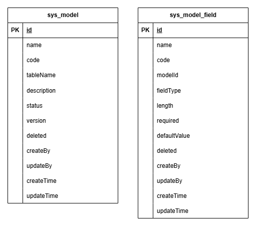

# Model-Engine

## 功能说明
Model Engine 是一个“元数据驱动的数据模型引擎服务”, 核心功能如下:
1. 管理模型定义
2. 管理字段定义
3. 动态创建数据库表
4. 提供实例数据 CRUD
5. 自动维护审计字段
6. 提供标准 REST API
---

## 运行环境
|       | 版本      |
|-------|---------|
| JDK   | 17      |
| MySQL | 8.0.21  |
---

## 核心模型

---

## 字段类型映射
| FieldType | MySQL         |
| --------- | ------------- |
| STRING    | VARCHAR(255)  |
| TEXT      | TEXT          |
| INTEGER   | INT           |
| LONG      | BIGINT        |
| DECIMAL   | DECIMAL(10,2) |
| BOOLEAN   | TINYINT(1)    |
| DATE      | DATE          |
| DATETIME  | DATETIME      |

